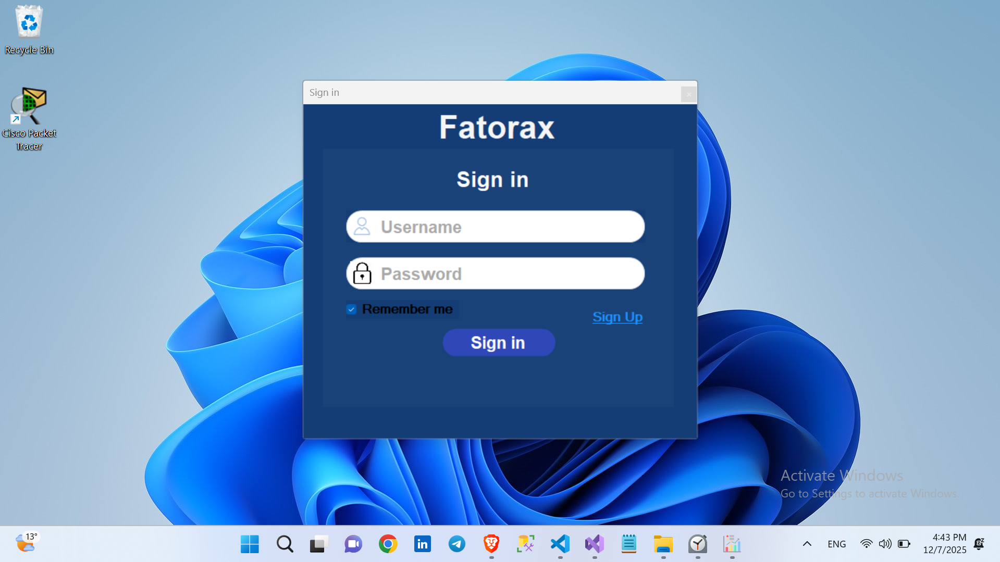
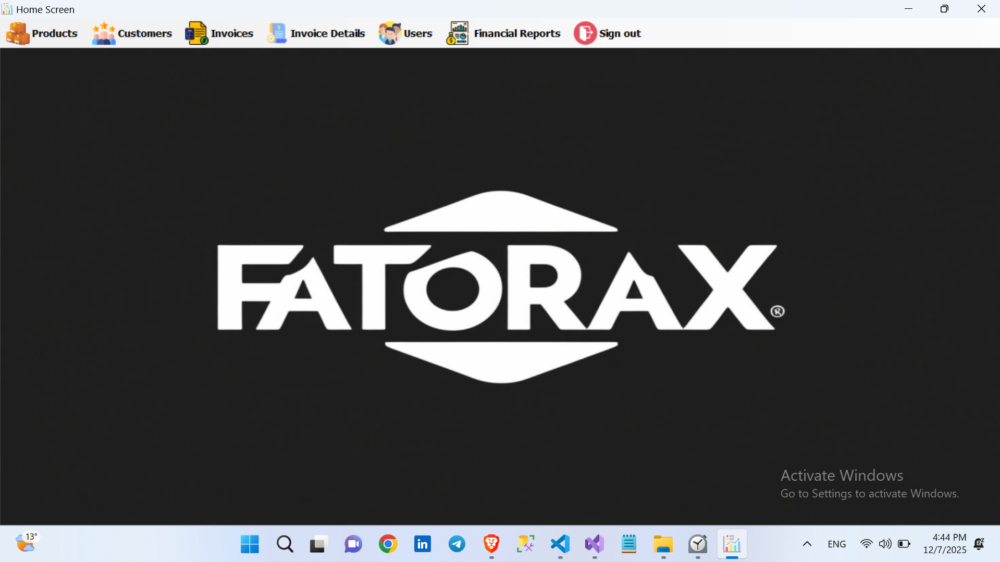
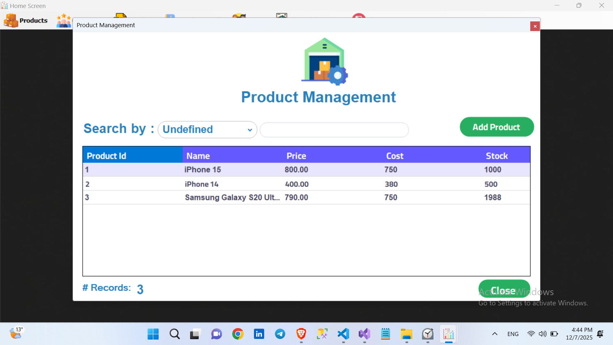
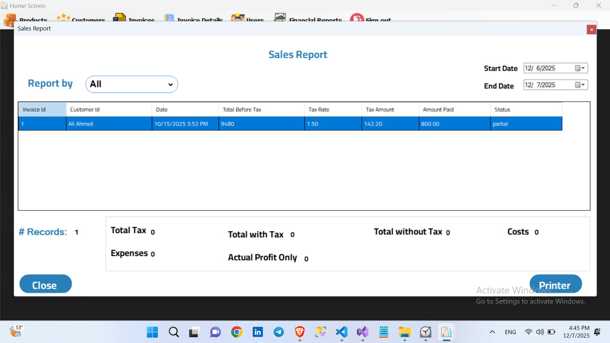

# 🛒 Fatorax - Point of Sale (POS) System

> **A professional desktop application designed for small to medium retail businesses to manage sales, inventory, and financial reporting efficiently.**

---

### 📸 Screenshots

  
  
   
  
  

---

### 🛠️ Tech Stack
* **Language:** C# (.NET Framework)
* **GUI:** Windows Forms (WinForms)
* **Database:** Microsoft SQL Server
* **Reporting:** Crystal Reports / Custom Reporting
* **Architecture:** Layered Architecture (N-Tier)

---

### ✨ Key Features
* **🔐 Secure Authentication:** Role-based login system (Admin/User) with activity monitoring.
* **📦 Inventory Management:** Real-time tracking of stock levels, adding/editing products, and low-stock alerts.
* **🧾 Invoicing System:** Fast and dynamic invoice generation with automatic tax calculation.
* **📊 Financial Reporting:** Comprehensive sales reports filtered by date, customer, or user (as seen in the screenshots).
* **👥 Customer & User Management:** Full CRUD operations for managing system users and customer data.

---

### 💾 Database Structure
The system is built on a robust SQL relational database ensuring data integrity and fast retrieval for transaction history and reports.

---

### 👤 Author
**Wali al-Din**
* [GitHub Profile](https://github.com/wliaal-din-code)
* [LinkedIn](https://www.linkedin.com/in/wali-al-din-mohammed-a1379035b/)
